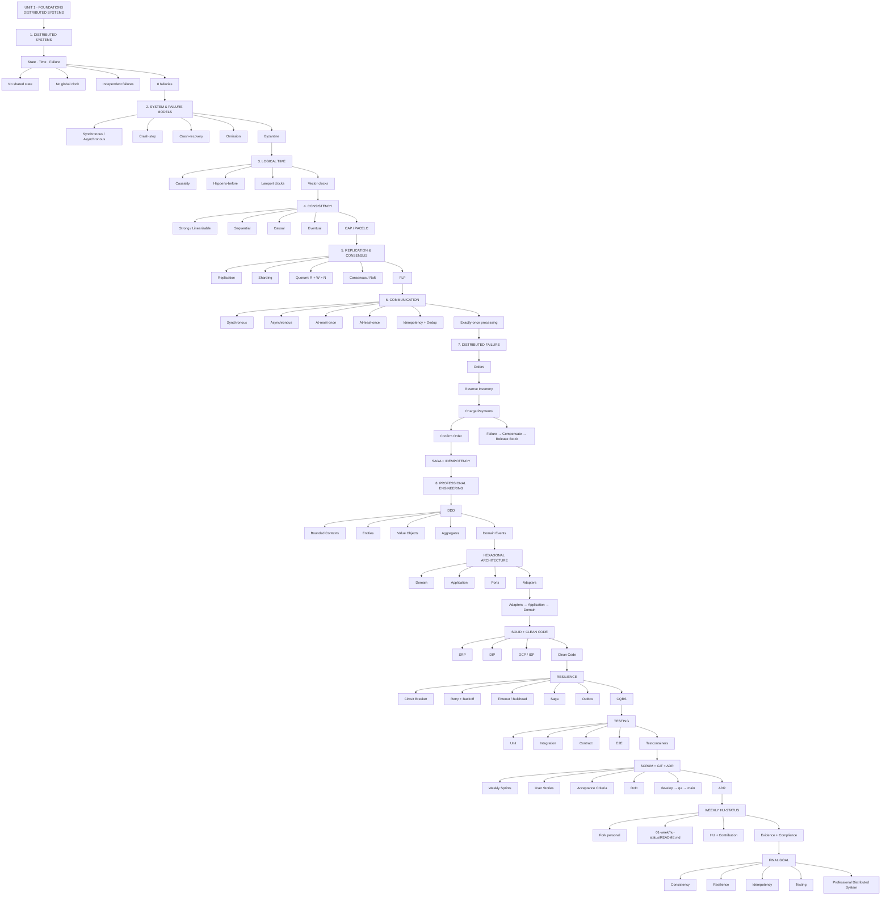

# Weekly Status - Week 01

<!-- CONFIG-START - must match your profile repo (username/username) CONFIG -->
- FULL_NAME: Ximena Del Pilar Zambrano Chala
- GITHUB_USER: XimenaChala
- TEAM: G1
- SPRINT_GOAL: Establish the foundations for the distributed systems project and apply professional engineering practices to MVP 1.
<!-- CONFIG-END -->

## 1. User stories worked this week

| HU ID | Title | Status (todo/doing/done) | Evidence (PR or commit URL) |
|---|---|---|---|
| HU-XXX-001 | Distributed Systems Foundations | done | https://github.com/XimenaChala/sistemas-distribuidos-2026-b-g1 |
| HU-XXX-002 | Select real problem for MVP 1 (EduTrack) | done | https://github.com/XimenaChala/sistemas-distribuidos-2026-b-g1 |

## 2. My individual contribution

- Reviewed the foundations of distributed systems and the changes introduced by communication over an unreliable network.
- Studied the eight fallacies of distributed computing.
- Reviewed synchronous and asynchronous system models.
- Reviewed failure models: crash-stop, crash-recovery, omission and Byzantine.
- Studied logical time, causality and the happens-before relationship.
- Reviewed Lamport clocks and vector clocks.
- Studied the consistency spectrum: strong/linearizable, sequential, causal and eventual consistency.
- Reviewed CAP and PACELC and their consistency/availability/latency trade-offs.
- Studied replication, partitioning/sharding and quorum reads/writes.
- Reviewed consensus, FLP impossibility and the Raft model.
- Reviewed synchronous and asynchronous communication.
- Studied delivery semantics: at-most-once, at-least-once and exactly-once processing.
- Reviewed idempotency, deduplication and the use of idempotency keys.
- Analyzed the distributed checkout scenario involving Orders, Inventory and Payments during a network partition.
- Reviewed the use of Saga and compensation for distributed consistency.
- Studied Domain-Driven Design and bounded contexts.
- Reviewed entities, value objects, aggregates and domain events.
- Studied hexagonal architecture and the relationship between domain, application, ports and adapters.
- Reviewed SOLID and Clean Code principles.
- Studied resilience patterns including Circuit Breaker, Retry, Timeout, Bulkhead, Saga, Outbox and CQRS.
- Reviewed the testing strategy: unit, integration, contract and E2E tests.
- Reviewed Testcontainers and coverage requirements.
- Reviewed Scrum, user stories, acceptance criteria, Definition of Ready and Definition of Done.
- Reviewed the Git workflow: `develop → qa → main`.
- Reviewed the per-environment HU branch and Pull Request strategy.
- Reviewed ADRs as a mechanism for documenting architecture decisions.
- Selected the real problem for MVP 1: **EduTrack**, a distributed platform for real-time school tracking (grades, attendance, notifications) for parents/guardians.
- Defined the initial bounded contexts: Academic Records, Attendance, Notifications, Communication and Identity/Accounts.
- Defined consistency levels and delivery semantics for the core operations of MVP 1 (grade registration, attendance marking, push notifications, parent-child account sync).
- Designed an initial Saga/Outbox flow for the "grade published → notification sent" scenario to handle partial failures without losing or duplicating events.
- Drafted initial user stories with testable acceptance criteria for the selected problem.
- Prepared the individual weekly HU-STATUS deliverable in the fork.

## 3. Blockers and risks

- No major blockers identified during the initial foundation review.
- Distributed systems introduce risks related to network partitions, message duplication, latency and independent failures.
- Future implementations must preserve the DDD and hexagonal architecture boundaries.
- Consistency and delivery semantics must be selected according to the requirements of each core operation.
- Consumers must be designed to handle message redelivery through idempotency and deduplication.
- Tests and runtime validation are required before considering a user story complete.
- The required Git branch and Pull Request flow must be maintained for each environment.
- Evidence links must be maintained for the automated weekly evaluation.
- Risk: notification delivery (at-most-once) may occasionally lose a push notification; this is an accepted trade-off and must be documented in an ADR.
- Risk: parent-child account sync across schools requires strong/linearizable consistency; incorrect implementation could duplicate or lose critical identity data.

## 4. Plan for next week

- Form and coordinate the project team.
- Finalize and prioritize the product backlog for EduTrack.
- Write full user stories with Gherkin-style acceptance criteria for MVP 1 core operations.
- Design the hexagonal architecture (domain, application, ports, adapters) for the Academic Records bounded context.
- Document architecture decisions through ADRs (consistency choices, delivery semantics, Saga/Outbox pattern).
- Set up the base project structure following DDD and hexagonal architecture.
- Prepare the required HU branches according to the environment workflow (hu-xxx-dev -> develop, ...).
- Add unit and integration tests for the first implemented functionality.
- Set up Testcontainers for integration testing.

## 5. Compliance self-check

- [x] Conventional Commits - `type(scope): summary`
- [x] Per-environment HU branch + PR to that environment (hu-xxx-dev -> develop, ...)
- [x] Testable acceptance criteria
- [ ] Tests added/updated (unit / integration)
- [x] DDD / hexagonal boundaries respected (domain has no I/O)
- [x] No secrets; config via environment variables

## 6. Evidence links

- Repository: https://github.com/XimenaChala/sistemas-distribuidos-2026-b-g1
- Week 01: https://github.com/XimenaChala/sistemas-distribuidos-2026-b-g1/tree/main/01-week
- HU-STATUS: https://github.com/XimenaChala/sistemas-distribuidos-2026-b-g1/tree/main/01-week/hu-status

## 7. Unit 1 - Foundations Diagram

