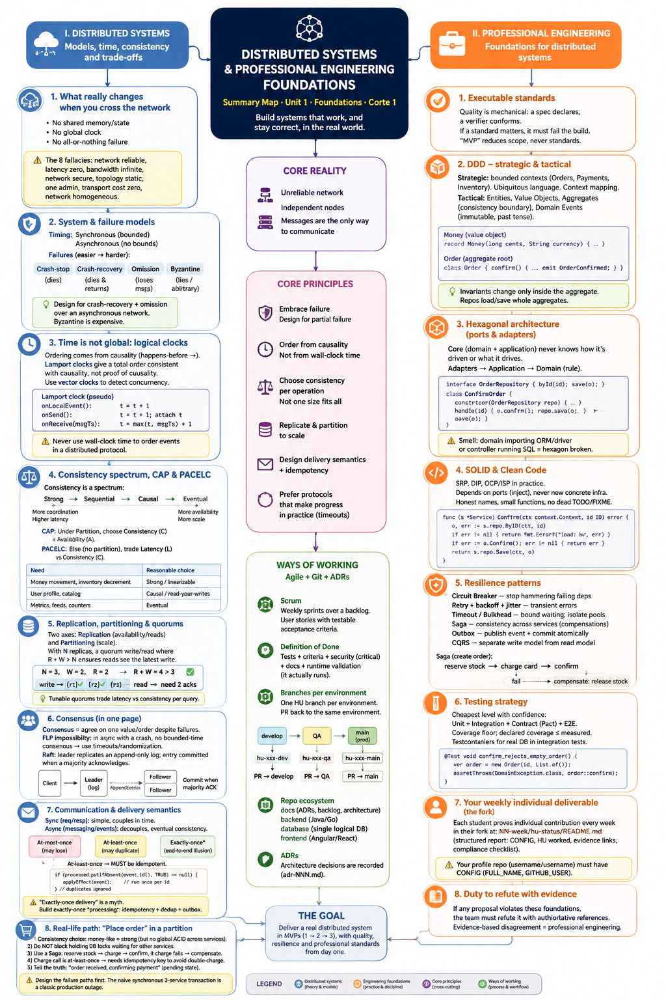

# Weekly Status - Week 01

<!-- CONFIG-START - must match your profile repo (username/username) CONFIG -->
- FULL_NAME: Ximena Del Pilar Zambrano Chala
- GITHUB_USER: XimenaChala
- TEAM: G1
- SPRINT_GOAL: Establish the foundations for the distributed systems project and apply professional engineering practices to MVP 1.
<!-- CONFIG-END -->

## 1. User stories worked this week

| HU ID | Title | Status (todo/doing/done) | Evidence (PR or commit URL) |
|---|---|---|---|
| HU-XXX-001 | Distributed Systems Foundations | done | https://github.com/XimenaChala/sistemas-distribuidos-2026-b-g1 |
| HU-XXX-002 | Select real problem for MVP 1 (EduTrack) | done | https://github.com/XimenaChala/sistemas-distribuidos-2026-b-g1 |

## 2. My individual contribution

- Reviewed the foundations of distributed systems and the changes introduced by communication over an unreliable network.
- Studied the eight fallacies of distributed computing.
- Reviewed synchronous and asynchronous system models.
- Reviewed failure models: crash-stop, crash-recovery, omission and Byzantine.
- Studied logical time, causality and the happens-before relationship.
- Reviewed Lamport clocks and vector clocks.
- Studied the consistency spectrum: strong/linearizable, sequential, causal and eventual consistency.
- Reviewed CAP and PACELC and their consistency/availability/latency trade-offs.
- Studied replication, partitioning/sharding and quorum reads/writes.
- Reviewed consensus, FLP impossibility and the Raft model.
- Reviewed synchronous and asynchronous communication.
- Studied delivery semantics: at-most-once, at-least-once and exactly-once processing.
- Reviewed idempotency, deduplication and the use of idempotency keys.
- Analyzed the distributed checkout scenario involving Orders, Inventory and Payments during a network partition.
- Reviewed the use of Saga and compensation for distributed consistency.
- Studied Domain-Driven Design and bounded contexts.
- Reviewed entities, value objects, aggregates and domain events.
- Studied hexagonal architecture and the relationship between domain, application, ports and adapters.
- Reviewed SOLID and Clean Code principles.
- Studied resilience patterns including Circuit Breaker, Retry, Timeout, Bulkhead, Saga, Outbox and CQRS.
- Reviewed the testing strategy: unit, integration, contract and E2E tests.
- Reviewed Testcontainers and coverage requirements.
- Reviewed Scrum, user stories, acceptance criteria, Definition of Ready and Definition of Done.
- Reviewed the Git workflow: `develop → qa → main`.
- Reviewed the per-environment HU branch and Pull Request strategy.
- Reviewed ADRs as a mechanism for documenting architecture decisions.
- Selected the real problem for MVP 1: **EduTrack**, a distributed platform for real-time school tracking (grades, attendance, notifications) for parents/guardians.
- Defined the initial bounded contexts: Academic Records, Attendance, Notifications, Communication and Identity/Accounts.
- Defined consistency levels and delivery semantics for the core operations of MVP 1 (grade registration, attendance marking, push notifications, parent-child account sync).
- Designed an initial Saga/Outbox flow for the "grade published → notification sent" scenario to handle partial failures without losing or duplicating events.
- Drafted functional and non-functional requirements and initial user stories with testable acceptance criteria for the selected problem.
- Prepared the individual weekly HU-STATUS deliverable in the fork.

## 3. Blockers and risks

- No major blockers identified during the initial foundation review.
- Distributed systems introduce risks related to network partitions, message duplication, latency and independent failures.
- Future implementations must preserve the DDD and hexagonal architecture boundaries.
- Consistency and delivery semantics must be selected according to the requirements of each core operation.
- Consumers must be designed to handle message redelivery through idempotency and deduplication.
- Tests and runtime validation are required before considering a user story complete.
- The required Git branch and Pull Request flow must be maintained for each environment.
- Evidence links must be maintained for the automated weekly evaluation.
- Risk: notification delivery (at-most-once) may occasionally lose a push notification; this is an accepted trade-off and must be documented in an ADR.
- Risk: parent-child account sync across schools requires strong/linearizable consistency; incorrect implementation could duplicate or lose critical identity data.

## 4. Plan for next week

- Form and coordinate the project team.
- Finalize and prioritize the product backlog for EduTrack.
- Write full user stories with Gherkin-style acceptance criteria for MVP 1 core operations.
- Design the hexagonal architecture (domain, application, ports, adapters) for the Academic Records bounded context.
- Document architecture decisions through ADRs (consistency choices, delivery semantics, Saga/Outbox pattern).
- Set up the base project structure following DDD and hexagonal architecture.
- Prepare the required HU branches according to the environment workflow (hu-xxx-dev -> develop, ...).
- Add unit and integration tests for the first implemented functionality.
- Set up Testcontainers for integration testing.

## 5. Compliance self-check

- [x] Conventional Commits - `type(scope): summary`
- [x] Per-environment HU branch + PR to that environment (hu-xxx-dev -> develop, ...)
- [x] Testable acceptance criteria
- [ ] Tests added/updated (unit / integration)
- [x] DDD / hexagonal boundaries respected (domain has no I/O)
- [x] No secrets; config via environment variables

## 6. Evidence links

- Repository: https://github.com/XimenaChala/sistemas-distribuidos-2026-b-g1
- Week 01: https://github.com/XimenaChala/sistemas-distribuidos-2026-b-g1/tree/main/01-week
- HU-STATUS: https://github.com/XimenaChala/sistemas-distribuidos-2026-b-g1/tree/main/01-week/hu-status

## 7. Problem statement and software requirements (EduTrack)

### 7.1 Problem statement

Parents today rely on scattered channels (WhatsApp, email, per-school platforms) to track their children's academic progress. There is no real-time visibility into grades, attendance or teacher communication, and existing platforms (Google Classroom, Moodle) are designed for teachers, not parents. Families with more than one child, or children in different schools, face even greater fragmentation.

**EduTrack** is a distributed system that centralizes school tracking (assignments, grades, attendance and communication) for parents/guardians, applying DDD, hexagonal architecture and resilience patterns to guarantee consistency under network failures.

### 7.2 Functional requirements

| ID | Requirement |
|---|---|
| RF-01 | The system shall allow parents to view their child's grades in near real time. |
| RF-02 | The system shall record and display student attendance, including absences and tardiness. |
| RF-03 | The system shall send push/email notifications to parents for relevant academic events, without duplicating alerts. |
| RF-04 | The system shall allow a parent account to be linked to multiple children, even across different schools. |
| RF-05 | The system shall allow direct, subject-scoped messaging between parents and teachers. |
| RF-06 | The system shall preserve the causal order of attendance events for the same student. |
| RF-07 | The system shall guarantee that a grade is not lost even if the notification service is unavailable. |
| RF-08 | The system shall guarantee that a parent-child link is neither duplicated nor lost during account synchronization. |

### 7.3 Non-functional requirements

| ID | Requirement |
|---|---|
| RNF-01 | Consistency: eventual consistency for grades and notifications; causal consistency for attendance; strong/linearizable consistency for identity/account sync. |
| RNF-02 | Reliability: at-least-once delivery with idempotency keys for grades and attendance; exactly-once for account sync via idempotency + outbox. |
| RNF-03 | Resilience: the system must apply Circuit Breaker, Retry with backoff, Timeout and Bulkhead to isolate failures between services. |
| RNF-04 | Availability: a failure in the Notifications service must not block grade or attendance registration (graceful degradation). |
| RNF-05 | Maintainability: each bounded context must follow hexagonal architecture (domain without I/O) and SOLID principles. |
| RNF-06 | Testability: unit, integration (Testcontainers), contract and E2E tests are required before a user story is considered done. |
| RNF-07 | Security: no secrets in code; configuration via environment variables. |
| RNF-08 | Observability: relevant domain events (grade published, attendance recorded, notification sent/failed) must be traceable end-to-end. |

### 7.4 Bounded contexts (DDD)

| Bounded Context | Responsibility |
|---|---|
| Academic Records | Manages assignments and grades |
| Attendance | Records and tracks student attendance |
| Notifications | Sends alerts to parents (push, email) |
| Communication | Direct parent-teacher chat |
| Identity/Accounts | Manages parent, child and school accounts |

### 7.5 Core operations — consistency and delivery semantics

| Operation | Consistency | Delivery semantics | Rationale |
|---|---|---|---|
| Register new grade | Eventual | At-least-once + idempotency key | Not critical to the millisecond, but must not be lost |
| Mark attendance (absence) | Causal | At-least-once + dedup | Order matters: "present" cannot arrive after "absent" for the same day |
| Send push notification | Eventual | At-most-once | Better to occasionally miss one than to spam duplicates |
| Sync parent-child account across schools | Strong/Linearizable | Exactly-once (idempotency + outbox) | Critical identity data; must not be duplicated or lost |

### 7.6 MVP 1 scope

**In scope:** grade viewing, attendance tracking, push/email notifications, parent-teacher messaging, multi-child/multi-school accounts.

**Out of scope (v2+):** AI-based academic risk prediction, shared academic calendar, automated monthly PDF reports.

## 8. System map

