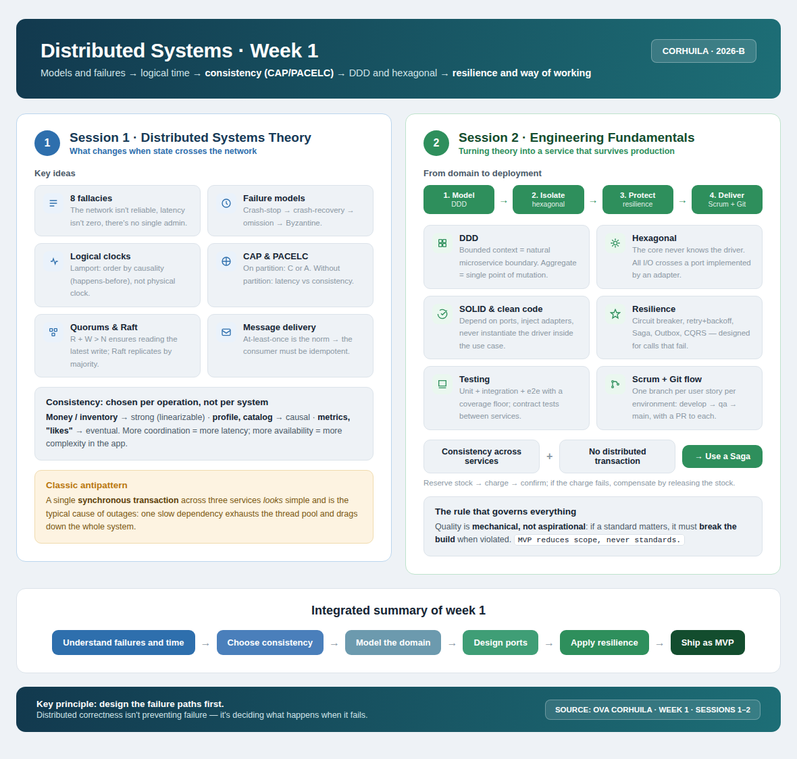

<!-- HU-STATUS TEMPLATE - do NOT remove the <!-- ... --> markers or the table headers.
     Your weekly grade is read AUTOMATICALLY from this file:
       01-week/hu-status/README.md  (inside YOUR fork). English. -->

# Weekly Status - Week 01

<!-- CONFIG-START - must match your profile repo (username/username) CONFIG -->
- FULL_NAME: Karen Johana Caicedo Arias
- GITHUB_USER: karencaicedo1907
- TEAM: CineSync Platform
- SPRINT_GOAL: Define and structure the Catalog & Showtimes Service, establishing domain models, database schema, indexing strategies, and REST API specifications for movies, theaters, and showtimes management.
<!-- CONFIG-END -->

## 1. User stories worked this week

| HU ID        | Title                                                               | Status (todo/doing/done) | Evidence (PR or commit URL) |
| ------------ | ------------------------------------------------------------------- | ------------------------ | --------------------------- |
| HU-CAT-001   | Implement CRUD operations for movie catalog management             | doing                    | Pending implementation      |
| HU-CAT-002   | Manage theaters, auditoriums, and screen formats (2D, 3D, IMAX)     | doing                    | Pending implementation      |
| HU-CAT-003   | Schedule showtimes linking movies, theaters, and time slots          | todo                     | Pending implementation      |
| HU-CAT-004   | Retrieve showtimes catalog with pagination, date, and genre filters  | doing                    | Pending implementation      |
| HU-CAT-005   | Implement indexing and caching strategies for high-frequency reads   | todo                     | Pending implementation      |

## 2. My individual contribution

* Defined the scope of the **Catalog & Showtimes Service** (`PRJ-CINE-CATALOG-SHOWTIMES-V1`), acting as the single source of truth for movie details, physical theater configurations, and showtime schedules across the platform.
* Evaluated tech stack options, selecting **Go** for high-performance read-heavy HTTP handling.
* Selected **PostgreSQL** as the persistent storage layer, designing document structures and relational schemas to handle flexible movie metadata and fast queries.
* Formulated database indexing strategies on fields like `release_date`, `genre`, and `showtime_date` to support high-throughput catalog browsing.
* Designed and documented the core REST API endpoints:
  * `GET /api/v1/movies` (paginated catalog listing with search and genre filtering)
  * `GET /api/v1/movies/{id}` (detailed movie record with trailer and poster metadata)
  * `GET /api/v1/showtimes` (query active movie functions by date, theater, or format)
  * `POST /api/v1/movies` (protected administrative endpoint for catalog creation)
* Established domain business rules to prevent schedule overlapping when assigning showtimes to specific auditoriums.
* Structured the microservice architecture following **DDD, TDD, SDD, SOLID, Clean Code, and Hexagonal Architecture**, isolating catalog domain entities from database persistence layers.
* Drafted initial OpenAPI / Swagger v3 specifications for public catalog consumption.

## 3. Blockers and risks

* Need alignment on whether schedule conflict validation should automatically calculate buffer times (e.g., movie duration + cleaning time) during showtime creation.
* Requires team consensus on whether poster images and media assets will be served via external CDN URLs or integrated with an object storage bucket.
* Clarification needed on multi-branch support: determining whether the catalog supports a single cinema complex or multi-theater complexes in Sprint 1.
* Decision pending on whether to integrate an in-memory Redis cache layer during Week 1 to optimize frequent read requests for daily showtimes.

## 4. Plan for next week

* Finalize domain entity models (`Movie`, `Theater`, `Showtime`, `Rating`).
* Initialize the repository structure for **Catalog & Showtimes Service** using Hexagonal Architecture.
* Write database migration or initialization scripts for MongoDB/PostgreSQL schemas and indexes.
* Implement unit tests using TDD for showtime scheduling logic and overlap prevention rules.
* Develop HTTP handlers and request validation middleware for public catalog routes.
* Implement pagination utilities for the `GET /api/v1/movies` endpoint.
* Generate and complete Swagger / OpenAPI documentation for all catalog routes.
* Containerize the service with a dedicated `Dockerfile` and integrate it into the `docker-compose` environment.

## 5. Compliance self-check

* [ ] Conventional Commits - `type(scope): summary`
* [ ] Per-environment HU branch + PR to that environment (`hu-xxx-dev -> develop`, ...)
* [x] Testable acceptance criteria defined at the design level
* [ ] Tests added/updated (unit / integration)
* [x] DDD / hexagonal boundaries respected (domain has no I/O)
* [x] No secrets; configuration via environment variables

### Notes

* User stories are currently in the initial design and specification phase; several stories are marked as `doing` or `todo`.
* Clean architecture principles are enforced so that movie catalog entities remain framework-independent.
* TDD approach will be followed during the construction of handlers, use cases, and repository adapters.
* Repository links and pull requests will be attached as implementation commits are created.

## 6. Evidence links

* **Catalog & Showtimes Service Product Brief / PDR:** `pdr.md`
* **Week 1 distributed systems diagram:** `distributed_systems_week1`

