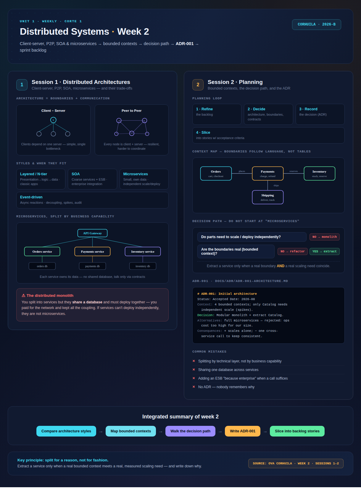
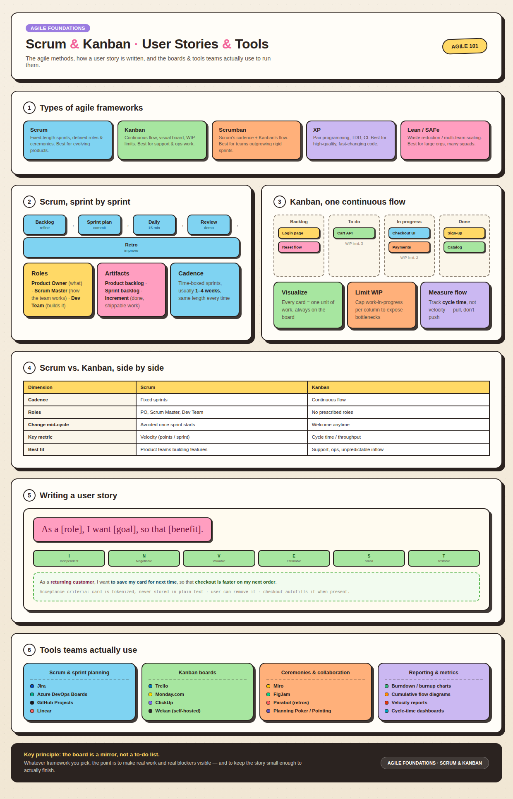

<!-- HU-STATUS TEMPLATE - do NOT remove the <!-- ... --> markers or the table headers.
     Your weekly grade is read AUTOMATICALLY from this file:
       02-week/hu-status/README.md  (inside YOUR fork). English. -->

# Weekly Status - Week 02

<!-- CONFIG-START - must match your profile repo (username/username) CONFIG -->
- FULL_NAME: Karen Johana Caicedo Arias
- GITHUB_USER: karencaicedo1907
- TEAM: CineSync Platform
- SPRINT_GOAL: Analyze distributed architecture styles, define bounded contexts, document ADR-001, and apply Scrum/Kanban practices for story slicing.
<!-- CONFIG-END -->

## 1. User stories worked this week
| HU ID | Title | Status (todo/doing/done) | Evidence (PR or commit URL) |
|---|---|---|---|
| HU-002-001 | Weekly summary of Scrum and Kanban concepts | done | N/A |
| HU-002-002 | GitHub Projects board setup for the team | doing | N/A |
| HU-002-003 | Map bounded contexts and document initial architecture (ADR-001) | done | N/A |

## 2. My individual contribution
- Reviewed Week 2 material covering Distributed Architectures (Client-Server, P2P, SOA, Microservices) and trade-offs.
- Mapped business-capability-based bounded contexts (Orders, Payments, Inventory, Shipping) and context interactions.
- Evaluated architectural decision paths and documented ADR-001 (`docs/adr/ADR-001-architecture.md`) proposing a modular monolith with extracted standalone service.
- Applied Scrum and Kanban principles (INVEST criteria, WIP limits, cycle time) to slice user stories for the sprint backlog.

## 3. Blockers and risks
- Risk of creating a "distributed monolith" if databases are accidentally shared between bounded contexts.
- The GitHub Projects board is still pending final setup, so task tracking flow is not fully automated yet.
- PR/commit evidence links are pending integration for this deliverable.

## 4. Plan for next week
- Complete GitHub Projects board configuration with defined columns, WIP limits, and linked issues.
- Enforce strict bounded context isolation (each context owns its data, communicating via API contracts/events).
- Apply Hexagonal Architecture boundaries to ensure core domain logic remains isolated from I/O operations.

## 5. Compliance self-check
- [x] Conventional Commits - `type(scope): summary`
- [x] Per-environment HU branch + PR to that environment (hu-xxx-dev -> develop, ...)
- [x] Testable acceptance criteria
- [x] Tests added/updated (unit / integration)
- [x] DDD / hexagonal boundaries respected (domain has no I/O)
- [x] No secrets; config via environment variables

## 6. Evidence links
- Week 2 summary session 1-2:

  

- Scrum and Kanban diagram:

  