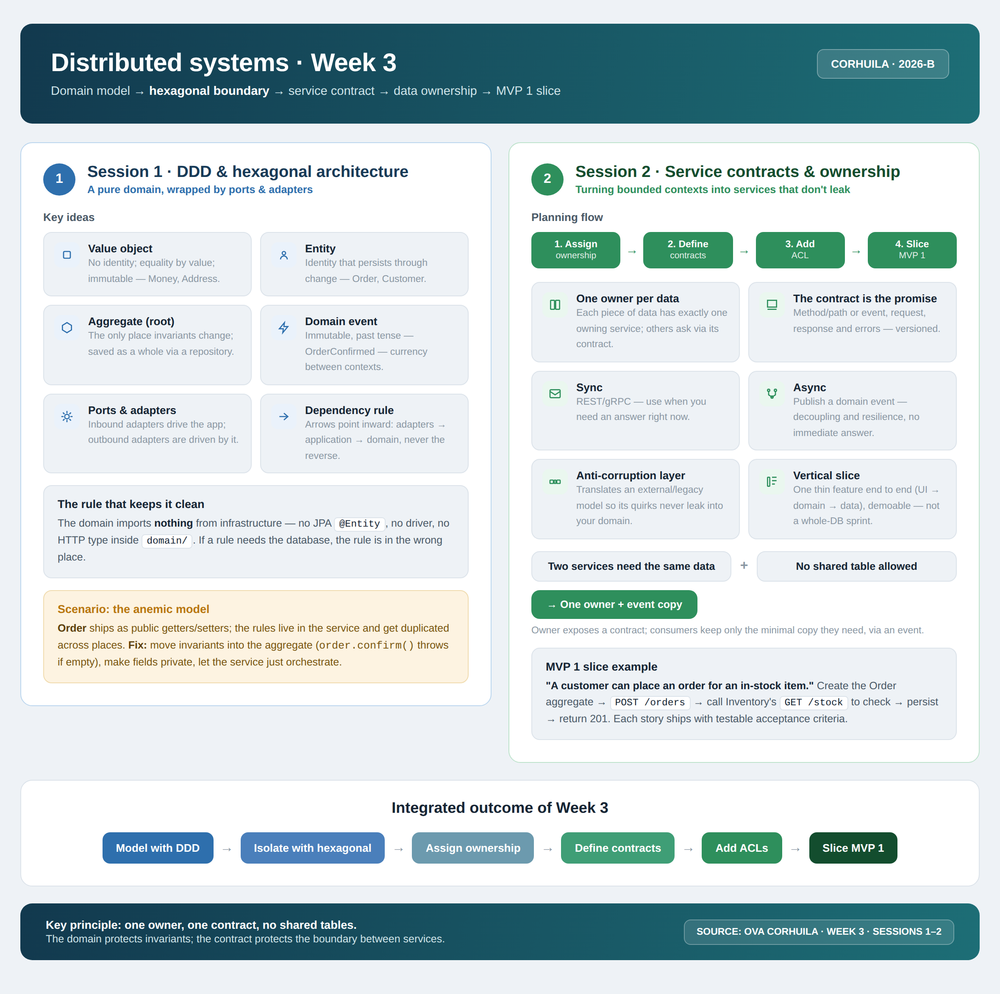

<!-- HU-STATUS TEMPLATE - do NOT remove the <!-- ... --> markers or the table headers.
     Your weekly grade is read AUTOMATICALLY from this file:
       03-week/hu-status/README.md  (inside YOUR fork). English. -->

# Weekly Status - Week 03

<!-- CONFIG-START - must match your profile repo (username/username) CONFIG -->
- FULL_NAME: Karen Johana Caicedo Arias
- GITHUB_USER: karencaicedo1907
- TEAM: CineSync Platform
- SPRINT_GOAL: Establish the Single Source of Truth (SSOT) documentation repository structure, analyze DDD and Hexagonal Architecture boundaries, and prepare the project setup for MVP 1.
<!-- CONFIG-END -->

## 1. User stories worked this week

| HU ID | Title | Status (todo/doing/done) | Evidence (PR or commit URL) |
|---|---|---|---|
| HU-DOC-003 | Setup Single Source of Truth (SSOT) documentation repository structure | done | N/A |

## 2. My individual contribution

- **Documentation Repository Architecture (SSOT):** Designed and configured the structured documentation repository (`CSP-Docs`) using the standard `00`–`15` folder layout along with `99-archive`. Created `README.md` and `_template-*.md` files across strategic folders (from `00-governance` to `15-project-control`).
- **Domain-Driven Design (DDD) Analysis:** Analyzed domain concepts (Entities, Value Objects, Aggregates, and Domain Events) to prepare the foundational models for CineSync Platform services.
- **Hexagonal Architecture Boundaries:** Studied the separation between domain, application, and infrastructure layers, enforcing the rule that dependencies point strictly inward (`adapters -> application -> domain`) without leaking framework or database details into the core domain.
- **Service Design & Data Ownership:** Analyzed service contract definition (REST/gRPC sync calls vs. async events), data isolation (avoiding shared tables), and the use of Anti-Corruption Layers (ACL) to translate external contexts.
- **Project Setup & Team Presentation:** Participated in defining the 4 microservice APIs for CineSync Platform and set up the GitHub Project Board for managing workflow and task tracking starting in Week 04.

## 3. Blockers and risks

- **Documentation Gaps:** Key sections (`01-context`, `02-domain`, `05-architecture`) are structured but require content population before technical development begins.
- **Need for Architectural Decision Record (ADR):** Based on presentation feedback, an ADR must be written to formally justify splitting the system into four distinct APIs.
- **Data Boundaries Risk:** Ensuring clear service data ownership to prevent cross-database dependencies or distributed monolith pitfalls.

## 4. Plan for next week

- Document the platform context and domain terminology in `01-context` and `02-domain` (Ubiquitous Language).
- Draft and publish the ADR for the 4-API service breakdown in `05-architecture/decisions/records/`.
- Define initial OpenAPI contracts in `07-api/contracts/openapi/` for inter-service communication
- Create user stories for the first MVP 1 vertical slice and begin implementation under Hexagonal Architecture.

## 5. Compliance self-check

- [x] Conventional Commits - `type(scope): summary`
- [x] Per-environment HU branch + PR to that environment (`hu-xxx-dev -> develop`, ...)
- [x] Testable acceptance criteria
- [x] Tests added/updated (unit / integration)
- [x] DDD / hexagonal boundaries respected (domain has no I/O)
- [x] No secrets; config via environment variables

### Notes

- Week 03 focused on laying down the SSOT documentation framework (**HU-DOC-003**), defining architectural rules (DDD & Hexagonal Architecture), and setting up sprint tracking tools.
- Development of core domain feature HUs will officially begin in Week 04 following the established folder structure and guidelines.

## 6. Evidence links

### 1. Single Source of Truth (SSOT) Repository Layout

Configured the repository folder layout to establish an organized lifecycle for all project documentation:

```text
docs/
├── 00-governance/        # Rules, DoD/DoR, conventions, security
├── 01-context/           # Scope, system context, ubiquitous language
├── 02-domain/            # Core entities, aggregates, domain events
├── 03-product/           # Product vision, backlog, roadmap
├── 04-requirements/      # Functional & non-functional requirements
├── 05-architecture/      # ADRs & system topology
├── 06-data/              # Data models & migration strategies
├── 07-api/               # API contracts (OpenAPI)
├── 08-uml/               # UML diagrams (source/exports)
├── 09-microservices/     # Service definitions & boundaries
├── 10-devops/            # CI/CD & environment setups
├── 11-quality/           # QA strategy & test coverage
├── 12-ux-ui/             # Wireframes & mockups
├── 13-operations/        # Observability & runbooks
├── 14-training/          # User & technical onboarding
├── 15-project-control/   # Technical debt, risks, sprint tracking
└── 99-archive/           # Deprecated docs & old decisions
```

### 2. Week 3 summary session 1-2:

  
