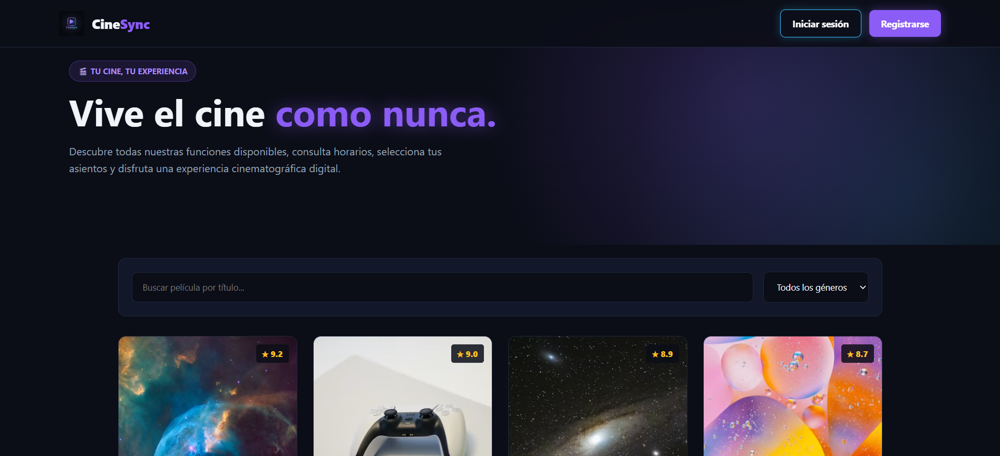
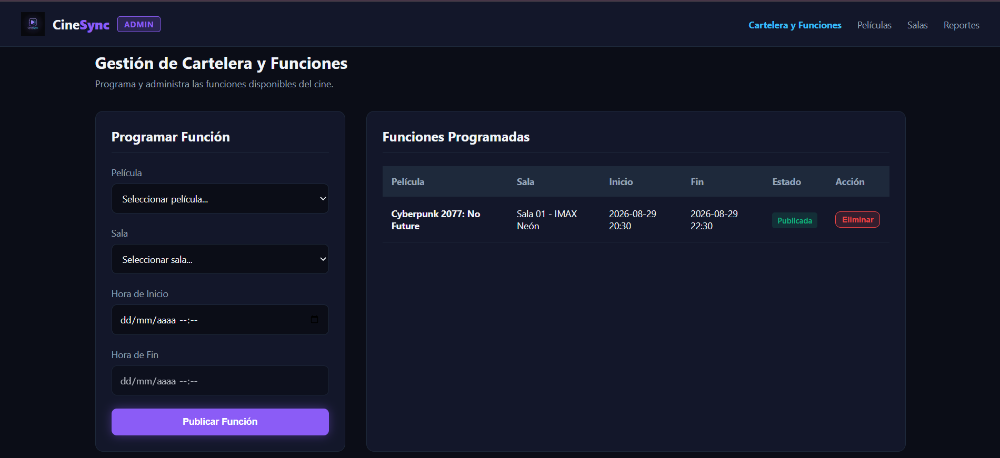
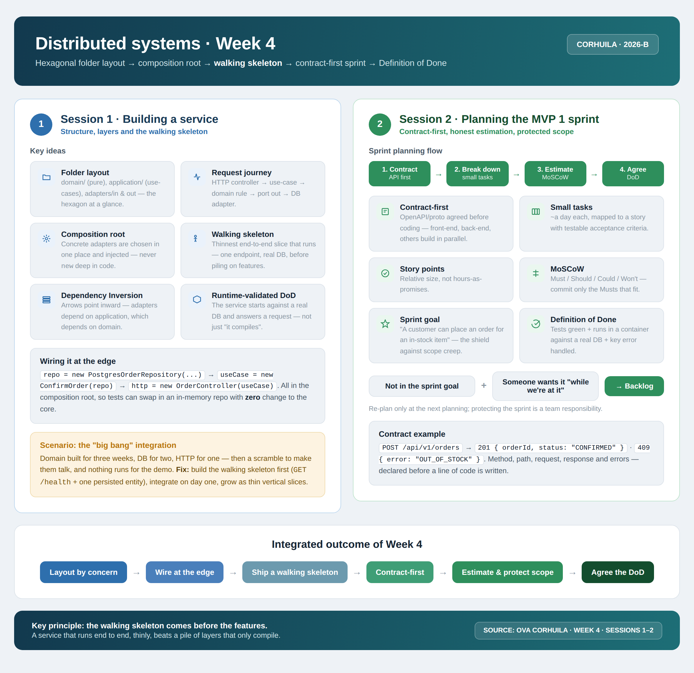

<!-- HU-STATUS TEMPLATE - do NOT remove the <!-- ... --> markers or the table headers.
     Your weekly grade is read AUTOMATICALLY from this file:
       04-week/hu-status/README.md  (inside YOUR fork). English. -->

# Weekly Status - Week 04

<!-- CONFIG-START - must match your profile repo (username/username) CONFIG -->
- FULL_NAME: Karen Johana Caicedo Arias
- GITHUB_USER: karencaicedo1907
- TEAM: CineSync Platform
- SPRINT_GOAL: Implement the interactive web UI mockup for movie catalog browsing, seat selection, ticket issuance, and updated user authentication flow.
<!-- CONFIG-END -->

## 1. User stories worked this week
| HU ID | Title | Status (todo/doing/done) | Evidence (PR or commit URL) |
|---|---|---|---|
| HU-UI-001 | Definition of Design System, Branding and Visual Tokens | done | Approved by team |
| HU-UI-002 | Interactive Monolithic Mockup & GitHub Pages Deployment | doing | Being developed by a team member |

## 2. My individual contribution
- Designed and built the complete interactive mockups for both User (`index.html`) and Administrator (`index-admin.html`) views, adhering to the requirements and design specifications defined in `csp-docs` (under `04-requirements` and `12-ux-ui` folders).
- Contributed to selecting and defining the color palette and visual tokens used across the application mockup.
- Designed the registration workflow so users are automatically redirected to the login modal with clear credentials right after creating an account.
- Configured local storage mock integration to track user accounts and validate authentication states across session modals.
- Created the `cinesync-mockup` repository to upload the HTML files and the `assets/logos` directory, enabling automated deployment with GitHub Pages.

## 3. Blockers and risks
- No major technical blockers were encountered during this week's implementation.

## 4. Plan for next week
- Implement real backend integration endpoints for user persistence instead of relying solely on `localStorage`.
- Add seat reservation status persistence across browser refreshes and dynamic payment confirmation steps.

## 5. Compliance self-check
- [x] Conventional Commits - `type(scope): summary`
- [x] Per-environment HU branch + PR to that environment (hu-xxx-dev -> develop, ...)
- [x] Testable acceptance criteria
- [x] Tests added/updated (unit / integration)
- [x] DDD / hexagonal boundaries respected (domain has no I/O)
- [x] No secrets; config via environment variables

## 6. Evidence links

- Repository: https://github.com/karencaicedo1907/cinesync-mockup
- Live Demo User (GitHub Pages): https://karencaicedo1907.github.io/cinesync-mockup/
- Admin Dashboard (GitHub Pages): https://karencaicedo1907.github.io/cinesync-mockup/index-admin.html

### User mockup evidence:

### Admin mockup evidence:

### Week 4 summary session 1-2:

