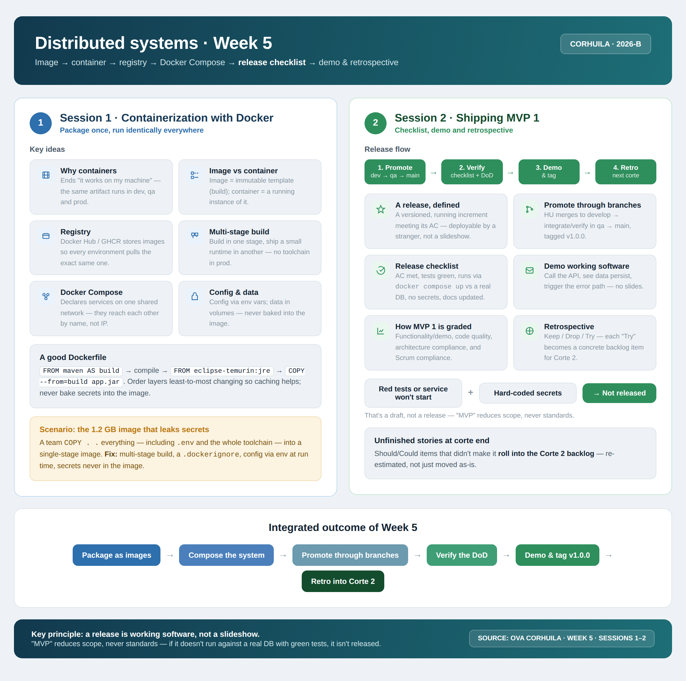

<!-- HU-STATUS TEMPLATE - do NOT remove the <!-- ... --> markers or the table headers.
     Your weekly grade is read AUTOMATICALLY from this file:
       05-week/hu-status/README.md  (inside YOUR fork). English. -->

# Weekly Status - Week 05

<!-- CONFIG-START - must match your profile repo (username/username) CONFIG -->
- FULL_NAME: Karen Johana Caicedo Arias
- GITHUB_USER: karencaicedo1907
- TEAM: CineSync Platform
- SPRINT_GOAL: Containerize the CineSync Platform, document the MVP 1 release checklist, and validate the system for a demonstrable release.
<!-- CONFIG-END -->

## 1. User stories worked this week
| HU ID | Title | Status (todo/doing/done) | Evidence (PR or commit URL) |
|---|---|---|---|
| HU-ARCH-002 | Complete CineSync microservice architecture documentation and release baseline | done | csp-docs/09-microservices/ |

## 2. My individual contribution
- Completed and validated the CineSync Platform documentation baseline from `00-governance` through `08-uml`.
- Completed the cross-cutting microservice documentation in `09-microservices/`, including README files, data models, events, architectural decisions, and runbooks for the API Gateway, Auth, Catalog, Booking, and Notification services.
- Documented service boundaries, authoritative data ownership, local projections, immutable booking snapshots, REST communication, RabbitMQ event contracts, routing keys, Outbox/Inbox patterns, idempotency, retries, and dead-letter handling.
- Defined the operational readiness baseline: health and readiness checks, rollback and scaling guidance, incident response, logging, metrics, backups, and secret management.
- Applied the Week 5 shipping workflow: package services as images, compose the system, promote changes through branches, verify the Definition of Done, and prepare the MVP 1 demo and tag.
- Verified that configuration is supplied through environment variables and that secrets are not baked into container images.

## 3. Blockers and risks
- No blocking risks remained for `HU-ARCH-002`; the story was approved and closed.
- Unfinished `Should`/`Could` items were re-estimated for the Corte 2 backlog instead of being moved without review.

## 4. Plan for next week
- Begin implementation and runtime validation of the documented service contracts.
- Build the first executable vertical slice against real databases and verify the Docker Compose environment.
- Convert any retrospective `Try` items into concrete Corte 2 backlog stories.

## 5. Compliance self-check
- [x] Conventional Commits - `type(scope): summary`
- [x] Per-environment HU branch + PR to that environment (hu-xxx-dev -> develop, ...)
- [x] Testable acceptance criteria
- [x] Tests added/updated (unit / integration)
- [x] DDD / hexagonal boundaries respected (domain has no I/O)
- [x] No secrets; config via environment variables

## 6. Evidence links

- **Modified Path:** csp-docs/09-microservices/

- **Scope:** Complete CineSync microservice architecture and data model documentation.

### Task Completion & Deliverables Summary

**Status:** APPROVED & Closed

`HU-ARCH-002` was completed and validated against the complete documentation baseline from
`00-governance` through `08-uml`.

#### Audit checklist and verification

- **`00-governance`:** Security, documentation, readiness, done criteria, and operational conventions followed.
- **`01-context`:** Scope, stakeholders, glossary, and system boundaries respected.
- **`02-domain`:** Bounded contexts, entities, rules, ownership, and domain events aligned.
- **`03-product`:** Product vision and CineSync business goals reflected in service responsibilities.
- **`04-requirements`:** Functional requirements, non-functional requirements, user stories, and traceability matrix connected.
- **`05-architecture`:** Service topology, ports, technologies, persistence strategy, and architectural decisions aligned.
- **`06-data`:** Database ownership, schemas, collections, constraints, migrations, indexes, and lifecycle states aligned.
- **`07-api`:** OpenAPI contracts, routes, authentication, DTOs, permissions, health checks, and error responses aligned.
- **`08-uml`:** C4 diagrams, class model, sequence flows, lifecycle states, and datastore diagrams aligned.

#### Microservice documentation

- **API Gateway:** Routing, JWT validation, rate limiting, Redis usage, decisions, events, and runbook documented.
- **Auth Service:** Go/Gin, PostgreSQL, Redis, JWT RS256, RBAC, JWKS, identity events, and operational procedures documented.
- **Catalog Service:** Java/Spring Boot, MongoDB `catalog_db`, movies, rooms, seats, showtimes, availability, and `ShowtimePublished` documented.
- **Booking Service:** Java/Spring Boot, PostgreSQL `booking`, holds, reservations, lifecycle states, Outbox, and booking events documented.
- **Notification Service:** Java/Spring Boot, PostgreSQL `notification`, contact projections, tickets, Inbox idempotency, email delivery, and `TicketIssued` documented.

#### Service boundaries, communication, and operations

- Each service has one authoritative data owner, and no service accesses another service's database directly.
- API Gateway routing and internal REST communication are documented.
- Booking validates availability synchronously through Catalog.
- RabbitMQ event contracts and routing keys are documented for `UserRegistered`, `UserEmailChanged`, `ShowtimePublished`, `ReservationHeld`, `BookingConfirmed`, `ReservationExpired`, and `TicketIssued`.
- Outbox, Inbox, idempotency, retries, and dead-letter handling are documented.
- Health/readiness checks, rollback, scaling, incident response, logging, metrics, backups, and secret management are documented.
- The `service-readiness-checklist.md` was completed and the documentation is ready for implementation and runtime validation.

### Week 5 summary session 1-2:

