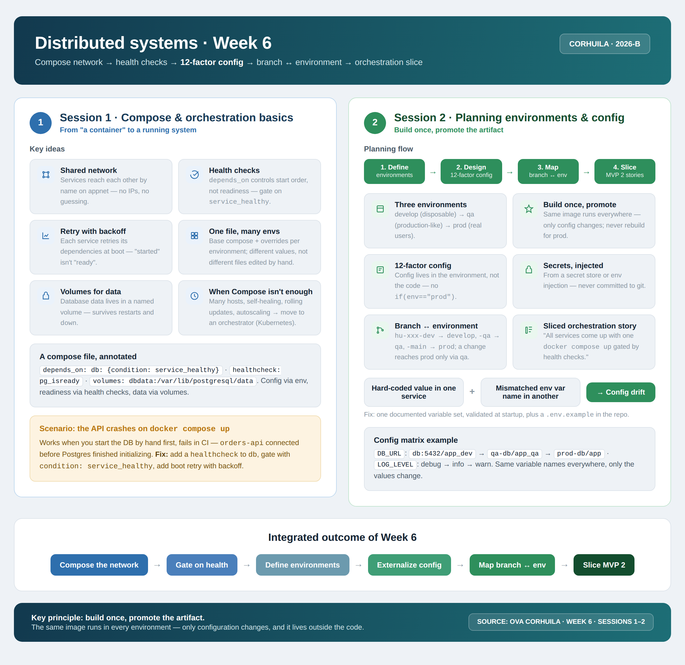

<!-- HU-STATUS TEMPLATE - do NOT remove the <!-- ... --> markers or the table headers.
     Your weekly grade is read AUTOMATICALLY from this file:
       06-week/hu-status/README.md  (inside YOUR fork). English. -->

# Weekly Status - Week 06

<!-- CONFIG-START - must match your profile repo (username/username) CONFIG -->
- FULL_NAME: Karen Johana Caicedo Arias
- GITHUB_USER: karencaicedo1907
- TEAM: CineSync Platform
- SPRINT_GOAL: Prepare and defend the Release 1.0.0 delivery for Corte 1, validate the distributed architecture baseline, and align the team around container networking, health checks, environment configuration, and the demo-ready MVP narrative.
<!-- CONFIG-END -->

## 1. User stories worked this week
| HU ID | Title | Status (todo/doing/done) | Evidence (PR or commit URL) |
|---|---|---|---|
| HU-REL-001 | Release 1.0.0 presentation and architecture validation for Corte 1 | done | Team presentation + mockup demo |
| HU-ARCH-003 | Container orchestration and environment configuration baseline | done | Week 06 architecture notes and release demo |

## 2. My individual contribution
- Co-presented the Release 1.0.0 for CineSync Platform alongside a teammate, explaining the product purpose, scope, architectural decisions, stack, cost model, and demo flow.
- Contributed to the narrative of the product vision, emphasizing the user experience, the administrative dashboard, and the microservice-based structure of the platform.
- Validated the narrative behind the platform architecture: API Gateway, Auth, Catalog, Booking, and Notification as independent service domains with isolated data ownership.
- Explained the interactive mockup used as proof of concept for the user and administrator journeys, highlighting how the UI mirrors the envisioned product behavior.
- Helped coordinate the team response during the Q&A and feedback rounds, while my teammates addressed the remaining questions from other groups.
- Reviewed the Week 6 technical concepts related to Docker Compose, network composition, health checks, 12-factor configuration, environment variables, and the release checklist for the next technical slice.

## 3. Blockers and risks
- No critical blockers were identified for the release presentation; the main effort was alignment and communication rather than technical blockage.
- The main risk was keeping the story concise during the 7-minute presentation while covering architecture, decisions, stack, cost, and the demo without losing clarity.
- The next development risk is to convert the validated architecture into a working MVP with real service integration and stricter environment management.

## 4. Plan for next week
- Convert the validated Release 1.0.0 design into a functional MVP slice with real service behavior.
- Strengthen the environment configuration and deployment workflow using explicit env files, health checks, and branch-based promotion flow.
- Continue the Docker Compose and service orchestration validation for the next iteration with production-like readiness checks.
- Define the next priority backlog items for MVP 2 based on the product and architecture feedback received during the release presentation.

## 5. Compliance self-check
- [x] Conventional Commits - `type(scope): summary`
- [x] Per-environment HU branch + PR to that environment (hu-xxx-dev -> develop, ...)
- [x] Testable acceptance criteria
- [x] Tests added/updated (unit / integration)
- [x] DDD / hexagonal boundaries respected (domain has no I/O)
- [x] No secrets; config via environment variables

## 6. Evidence links
- User mockup: https://karencaicedo1907.github.io/cinesync-mockup/
- Admin mockup: https://karencaicedo1907.github.io/cinesync-mockup/index-admin.html#/admin/billboard
- Repository doc: https://github.com/code-corhuila/csp-docs.git

### Release 1.0.0 presentation summary

This week the team prepared and presented the first release of CineSync Platform for Corte 1. The presentation was delivered in two-person format, with the rest of the team covering Q&A from other groups. We explained the system as a distributed platform focused on movie discovery, session management, seat selection, and digital ticket issuance for a cinema experience.

The presentation included:
- Project purpose and value proposition
- Product scope and users
- Main architectural decisions
- Technology stack and estimated operating cost
- Distributed architecture and service boundaries
- Demo of the user and admin mockups
- Release readiness explanation for the initial MVP and future iterations

The core message presented was that CineSync is built around a microservice topology where:
- The API Gateway coordinates access and routes requests
- Auth handles identity, login, and roles
- Catalog manages movies, rooms, seats, and showtimes
- Booking validates availability and manages holds/reservations
- Notification receives events and emits digital tickets

The architecture also emphasized:
- REST for synchronous operations
- RabbitMQ events for asynchronous workflows such as `BookingConfirmed` and `TicketIssued`
- Independent data ownership per service
- Health checks and environment-based configuration for deployment readiness

### Week 6 summary session 1-2:

