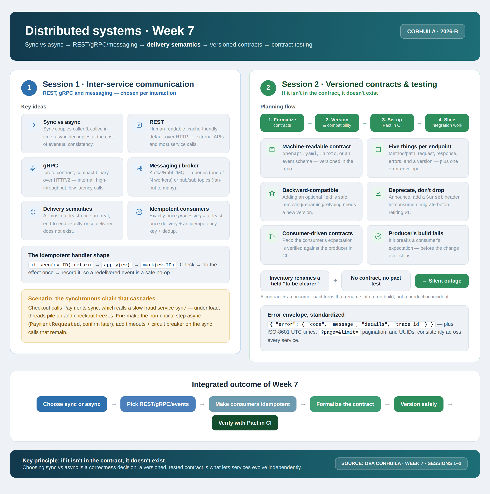

<!-- HU-STATUS TEMPLATE - do NOT remove the <!-- ... --> markers or the table headers.
     Your weekly grade is read AUTOMATICALLY from this file:
       07-week/hu-status/README.md  (inside YOUR fork). English. -->

# Weekly Status - Week 07

<!-- CONFIG-START - must match your profile repo (username/username) CONFIG -->
- FULL_NAME: Karen Johana Caicedo Arias
- GITHUB_USER: karencaicedo1907
- TEAM: CineSync Platform
- SPRINT_GOAL: Update and validate the CineSync Platform data documentation, align database ownership and migration rules, and prepare the changes for final review.
<!-- CONFIG-END -->

## 1. User stories worked this week
| HU ID | Title | Status (todo/doing/done) | Evidence (PR or commit URL) |
|---|---|---|---|
| HU-DATA-001 | Update CineSync data documentation and database ownership baseline | done | Documentation changes in `06-data/` |
| HU-DATA-002 | Review migration rules, modeling conventions, and data models | done | Two Pull Requests prepared for review |

## 2. My individual contribution
- Updated the documentation in `06-data/`, including the data guides, migration strategy, modeling conventions, and service data models for CineSync Platform.
- Organized the documentation changes into two Pull Requests to respect the maximum limit of 400 changed lines per Pull Request.
- Addressed the observations and requested adjustments made by the reviewers.
- Updated file names to make the documentation structure clearer and more consistent with the project conventions.
- Corrected and clarified the migration rules, including the expected order and responsibility for applying database changes.
- Updated the database ownership summary so each CineSync service has a clearly identified authoritative data boundary.
- Prepared the final documentation state for the professor's review bot.
- Applied the Week 7 principles to the documentation baseline: explicit contracts, clear ownership, compatibility across changes, and traceable service boundaries.

## 3. Blockers and risks
- The main constraint was keeping each Pull Request within the 400-line review limit, which required splitting and organizing the documentation work carefully.
- Reviewer observations required updates to file names, migration rules, and the database ownership summary before the final review.
- The remaining risk is that future schema changes must preserve compatibility with service contracts and must not introduce direct access to another service's database.
- The changes are currently ready for the professor's final review bot; any additional observations may require a final documentation adjustment.

## 4. Plan for next week
- Monitor and address the results of the professor's review bot.
- Finalize any remaining documentation corrections in `06-data/` and `07-api/`
- Relate the documented data models and migration rules to the versioned API and event contracts.
- Continue defining contract and integration validation for the CineSync services, including idempotent consumers and backward-compatible changes.

## 5. Compliance self-check
- [x] Conventional Commits - `type(scope): summary`
- [x] Per-environment HU branch + PR to that environment (hu-xxx-dev -> develop, ...)
- [x] Testable acceptance criteria
- [x] Tests added/updated (unit / integration)
- [x] DDD / hexagonal boundaries respected (domain has no I/O)
- [x] No secrets; config via environment variables

## 6. Evidence links
- Data documentation folder: `06-data/`
- Pull Request 1: documentation update for the first part of `06-data/`
- Pull Request 2: documentation update for the remaining `06-data/` changes

### Week 7 work summary

During this week, the CineSync Platform data documentation was updated and organized for review. The work covered the data guides, migration strategy, modeling conventions, and service data models. The changes were divided into two Pull Requests so that each review stayed within the 400-line limit.

The review feedback was addressed by:

- Renaming files for consistency and easier navigation.
- Correcting and clarifying migration rules.
- Updating the database ownership summary.
- Keeping each service responsible for its own authoritative data.
- Preparing the final version for the professor's review bot.

The result is a clearer data baseline that supports the rest of the CineSync architecture and reduces ambiguity when services evolve independently. After the `06-data` reviews are completed successfully and the changes are merged, the same review and merge process will be applied to the `07-api` folder.

### Week 7 technical alignment

The week's material also reinforced the communication principles required by the project:

- Choose synchronous REST or asynchronous messaging according to the interaction's needs.
- Keep service communication based on explicit, machine-readable contracts.
- Treat delivery as at-most-once or at-least-once and make consumers idempotent when events may be redelivered.
- Prefer backward-compatible contract changes and deprecate fields before removing them.
- Validate producer and consumer expectations with contract testing in CI.
- Keep error responses, identifiers, timestamps, pagination, and versioning consistent across services.

For CineSync, these principles support the REST availability check between Booking and Catalog and the RabbitMQ event flow between Booking and Notification, including `BookingConfirmed` and `TicketIssued`.

### Week 7 summary session 1-2:

